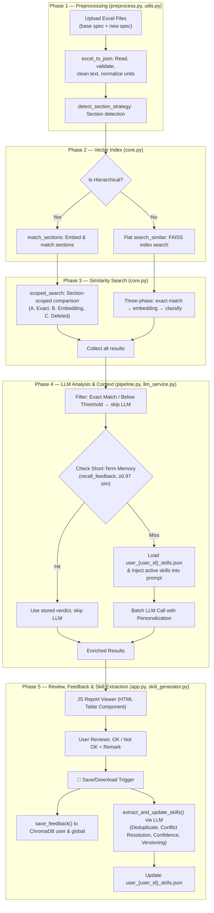
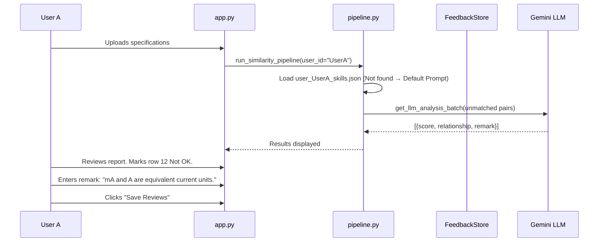
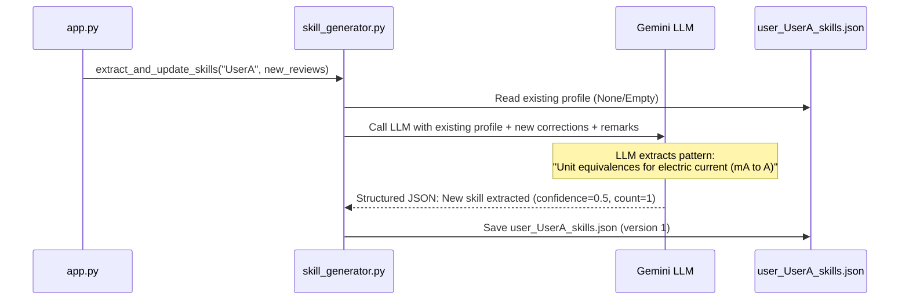
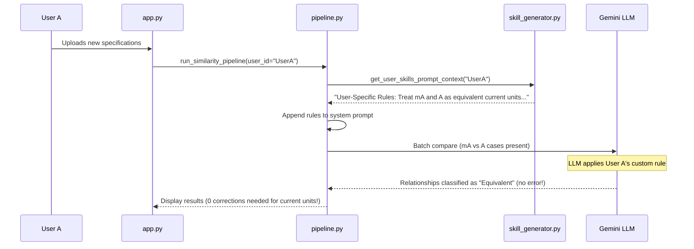

# AIS Assist — Definitive Implementation Plan

> **Scope**: Dual-layer relearning memory, interactive JS report viewer, continuous user learning loop, and production bug fixes.
> **Codebase**: 14 Python modules + 5 prompt files + `app.py` (997 lines).

---

## 1. Complete System Architecture

### 1.1 Current & Target Pipeline (6-Skill Flow with Continuous Learning)



### 1.2 Token-Saving Architecture (Exact Match = No LLM Cost)

The system has a **three-layer token optimization** strategy:

| Layer | Where | How it saves tokens | Status |
|-------|-------|---------------------|--------|
| **Exact String Match** | [core.py L650-669](file:///c:/Users/vicky/Documents/vicky%20project/Exchange-main/Exchange/am_ais_assist/core.py#L650-L669) | If `Cleaned_Text` is identical → score=1.0, label="Exact Match", **zero embedding + zero LLM cost** | ✅ Working |
| **Score Thresholds** | [pipeline.py L238-249](file:///c:/Users/vicky/Documents/vicky%20project/Exchange-main/Exchange/am_ais_assist/pipeline.py#L238-L249) | `≥ LLM_PERFECT_MATCH_THRESHOLD` → "Exact Match" (no LLM). `< LLM_ANALYSIS_MIN_THRESHOLD` → "Below Threshold" (no LLM) | ✅ Working |
| **Short-Term Memory Recall** | [pipeline.py L204-234](file:///c:/Users/vicky/Documents/vicky%20project/Exchange-main/Exchange/am_ais_assist/pipeline.py#L204-L234) | If a semantically identical pair (≥0.97 cosine) was reviewed before → use stored verdict, **skip LLM** | ✅ Working |
| **LLM Result Cache** | [llm_service.py L383-406](file:///c:/Users/vicky/Documents/vicky%20project/Exchange-main/Exchange/am_ais_assist/llm_service.py#L383-L406) | `GlobalCacheManager` + per-user disk cache with SHA-256 keys. Cache hit → no API call | ✅ Working |

> [!TIP]
> **Exact matches are the biggest token saver.** For a 500-row file where 300 rows are identical, only 200 rows go through embedding + LLM. This saves ~60% of API costs.

---

## 2. Current State vs Expected State

### 2.1 Short-Term Memory & Continuous Learning (User-Scoped)

| Aspect | Current State | Expected State | Gap |
|--------|--------------|----------------|-----|
| **Storage** | ChromaDB `fb_{user_id}` collections | Same + persistent JSON profiles | ✅ None |
| **Recall** | `recall_feedback()` checks cosine similarity ≥0.97 | Same | ✅ None |
| **Filter** | **All reviewed rows stored** including Exact Match | **Only non-exact matches** stored in ChromaDB and skill extraction | ❌ **BUG: No filter** |
| **Remark capture** | No remark collected from user in current review UI | When user clicks "Not OK", popup modal/input collects a short remark | ❌ **Not implemented** |
| **Skill Profile JSON** | Not implemented | Structured JSON file `user_{user_id}_skills.json` storing extracted skills, confidence, and version history | ❌ **Not implemented** |
| **Skill Extraction & Merge** | Not implemented | On Save/Download, LLM processes corrections & remarks, deduplicates, resolves conflicts, and merges into the profile | ❌ **Not implemented** |
| **Prompt Injection** | Not implemented | Loads active skills (confidence ≥ threshold) and appends to comparison system prompt | ❌ **Not implemented** |

### 2.2 Long-Term Memory (Global)

| Aspect | Current State | Expected State | Gap |
|--------|--------------|----------------|-----|
| **Storage** | `feedback_global` collection | Same | ✅ None |
| **Analysis trigger** | Admin-only, manual button click in app.py admin panel | **Dual trigger**: admin manual + **automatic** when `Not OK ≥ FEEDBACK_MIN_NOT_OK` (default 50) | ❌ **Auto-trigger missing** |
| **5-Gate pipeline** | Gates 1-3 in [self_improve.py](file:///c:/Users/vicky/Documents/vicky%20project/Exchange-main/Exchange/am_ais_assist/self_improve.py) | Same | ✅ Working |
| **Data retention** | **None** — unbounded growth | Add TTL-based cleanup (configurable, default 90 days) | ❌ **Retention missing** |

### 2.3 Interactive Report Viewer

| Aspect | Current State | Expected State | Gap |
|--------|--------------|----------------|-----|
| **Rendering** | Static HTML table | Interactive JS component with filtering, sorting, review actions | ❌ **Not implemented** |
| **Filtering** | Only in Streamlit sidebar via `st.selectbox` | Client-side column filters (Level, Score range, Review status) in table header | ❌ **Not implemented** |
| **Review UI** | `st.data_editor` with selectbox per row | Inline ✅/❌ buttons + modal remark popup on "Not OK" | ❌ **Not implemented** |
| **"Approve All Exact"** | Not implemented | One-click button to mark all Exact Match rows as "OK" | ❌ **Not implemented** |

---

## 3. How the Continuous User Learning Loop Works — Walkthrough

### 3.1 Will It Work? (Feasibility Analysis)

Yes, the proposed Continuous User Learning Loop will work, and it represents a state-of-the-art approach to personalized AI agents. Here is why and how:
1. **Personalization without Global Drift**: By keeping the extraction user-specific (`user_{user_id}_skills.json`), we prevent one user's custom preferences (which might be domain-specific or team-specific) from polluting the global model prompt or affecting other users.
2. **Context-Budget Aware Injection**: We do not load the raw history of reviews (which would quickly exhaust the token context). Instead, the LLM distills them into a small, clean set of rule descriptions (structured skills) with a few key examples. Only skills that cross a confidence threshold are injected, keeping prompt tokens low.
3. **Deduplication and Conflict Resolution**: When new reviews are saved, the LLM compares the incoming corrections with existing skills. It refines the existing skills when there is agreement (deduplication) or modifies the rule constraints/lowers the confidence score when there is a contradiction (conflict resolution).
4. **Non-Blocking Background Threading**: Skill extraction is run asynchronously using Python's `threading.Thread`. When the user clicks "Save Reviews" or downloads the Excel file, the UI remains highly responsive while the background agent performs the LLM skill compilation and updates the JSON profile.

### 3.2 Scenario: User A — First Run (No Skills Yet)



### 3.3 Scenario: User A — Save & Skill Extraction (The Learning Phase)



### 3.4 Scenario: User A — Second Run (Tuned Matching)



---

## 4. Production Bugs Found & Target Fixes

### Critical Bugs

- **BUG-A: Error results cached permanently** in `llm_service.py` L399-402. The filter checks for specific error strings, but `_call_llm_api` raises `JSONDecodeError Error` or `ValueError Error` which bypasses the check, writing errors to the cache.
  - *Fix*: Check if `Similarity_Level` ends with `"Error"` or matches `"LLM API Call Failed"`.
- **BUG-B: `response.content` can be None** in `llm_service.py` L287. If Gemini returns empty content, `estimate_tokens(content)` throws a `TypeError`.
  - *Fix*: Default content to empty string: `content = response.choices[0].message.content or ""`.
- **BUG-C: No filter on feedback storage** in `app.py` L353-387. All reviewed rows, including exact matches, are stored in ChromaDB. This wastes storage and pollutes semantic recall.
  - *Fix*: Only save feedback to ChromaDB and the learning loop if the level is NOT `"Exact Match"` or `"Below Threshold"`.
- **BUG-D: Ghost records in ChromaDB** in `feedback_store.py` L199-201. If embedding fails, records are stored without embeddings, making them unretrievable via semantic search.
  - *Fix*: Add `has_embedding` metadata flag and filter by it in `recall_feedback()`.
- **BUG-E: `save_llm_cache` lacks file locks** in `llm_service.py` L152-166. Concurrent writes can corrupt the cache.
  - *Fix*: Add file locking or deprecate and replace all calls with `_append_to_user_cache`.

---

## 5. Proposed Changes

### Component 1: Interactive JS Report Viewer

#### [MODIFY] [postprocess.py](file:///c:/Users/vicky/Documents/vicky%20project/Exchange-main/Exchange/am_ais_assist/postprocess.py)

Implement `render_interactive_report(df, base_data, user_data) → str` generating HTML+CSS+JS:
- Sticky header with dropdown column filters (Level, Score, Review Status).
- Text search across all columns.
- Inline ✅ OK / ❌ Not OK buttons.
- On "Not OK" click: modal popup collecting remark text (max 200 chars).
- Bidirectional messaging via `Streamlit.setComponentValue()`.

#### [MODIFY] [app.py](file:///c:/Users/vicky/Documents/vicky%20project/Exchange-main/Exchange/app.py)

- Replace `st.markdown(html_table)` with `render_interactive_report()`.
- Handle returned JS review array and update `st.session_state.review_statuses` & remarks.

---

### Component 2: UI Remark Capture & Filtering

#### [MODIFY] [app.py](file:///c:/Users/vicky/Documents/vicky%20project/Exchange-main/Exchange/app.py)

In the `Save Reviews` button logic, extract user remarks along with OK/Not OK verdicts:
```python
# Skip storing feedback for trivial matches
if ai_level in ("Exact Match", "Below Threshold"):
    continue

# Extract user-defined remark from UI review state
user_remark = review_remarks.get(qid, "")
```

#### [MODIFY] [feedback_store.py](file:///c:/Users/vicky/Documents/vicky%20project/Exchange-main/Exchange/am_ais_assist/feedback_store.py)

Add `user_remark` to `save_feedback()` metadata:
```python
metadata["user_remark"] = str(user_remark)[:200]
```

---

### Component 3: Continuous User Learning Loop & Skills Profile

#### [NEW] [skill_generator.py](file:///c:/Users/vicky/Documents/vicky%20project/Exchange-main/Exchange/am_ais_assist/skill_generator.py)

Create a module dedicated to managing `user_{user_id}_skills.json` profiles:

##### Profile Schema Structure (`user_{user_id}_skills.json`)
```json
{
  "user_id": "user_identifier",
  "version": 1,
  "last_updated": "2026-06-21T21:19:37Z",
  "skills": [
    {
      "id": "skill_uuid",
      "pattern_description": "Rule explaining when items are Equivalent, Related, or Contradictory.",
      "rules": ["mA = 0.001 A", "Milliampere is equivalent to Ampere after scaling"],
      "examples": [
        {
          "base_text": "Output: 500mA",
          "new_text": "Output: 0.5A",
          "user_decision": "Equivalent",
          "user_remark": "Units are equivalent after conversion"
        }
      ],
      "confidence_score": 0.85,
      "occurrence_count": 2
    }
  ],
  "history": [
    {
      "version": 1,
      "timestamp": "2026-06-21T21:19:37Z",
      "change_summary": "Extracted new unit conversion rule for mA to A."
    }
  ]
}
```

##### Core Functions
- `load_user_skills(user_id: str) -> dict`: Load profile with `filelock` to ensure multi-thread safety.
- `get_user_skills_prompt_context(user_id: str) -> str`: Loads active skills (confidence ≥ 0.70), formats them as system instructions:
  ```text
  🔑 User-Specific Matching Rules:
  - Rule: <pattern_description>
    Examples:
    * Base: "<base_text>" | New: "<new_text>" → Decision: <user_decision>
  ```
- `extract_and_update_skills(user_id: str, new_reviews: list[dict]) -> None`: Runs in a background thread. Calls Gemini LLM with existing skills JSON + new corrections & remarks to perform deduplication, conflict resolution, score adjustments, and history updates.

##### LLM Skill Extraction System Prompt
```text
You are a prompt engineering and requirements analysis compiler.
Your task is to merge new human corrections and remarks into the user's existing matching skills profile.

Analyze the new reviews and perform:
1. Deduplication: If a new correction fits an existing skill, add the example, increment occurrence_count, and increase confidence_score.
2. Conflict Resolution: If new corrections contradict existing rules, refine the rule constraints or reduce the confidence_score.
3. New Rule Extraction: If a correction represents a new pattern or business logic, create a new skill object (initial confidence = 0.50).
4. Limit Bloat: Keep descriptions concise and restrict examples to a maximum of 3 per skill.

Return the updated profile matching the JSON schema.
```

#### [MODIFY] [pipeline.py](file:///c:/Users/vicky/Documents/vicky%20project/Exchange-main/Exchange/am_ais_assist/pipeline.py)

- Pass stable `user_id` from `app.py` through `run_similarity_pipeline` down to `run_llm_analysis_phase`.
- Load user skill prompt context:
  ```python
  if user_id:
      from am_ais_assist.skill_generator import get_user_skills_prompt_context
      user_rules = get_user_skills_prompt_context(user_id)
      if user_rules:
          active_prompt_text = active_prompt_text + "\n\n" + user_rules
  ```

#### [MODIFY] [app.py](file:///c:/Users/vicky/Documents/vicky%20project/Exchange-main/Exchange/app.py)

- In the "Save Reviews" logic, pass the stable `st.session_state.user_id` to the pipeline.
- Start the skill extraction asynchronously:
  ```python
  import threading
  from am_ais_assist.skill_generator import extract_and_update_skills
  
  # Spin off LLM extraction into background thread to avoid freezing UI
  threading.Thread(
      target=extract_and_update_skills,
      args=(user_id, corrections_list),
      daemon=True
  ).start()
  ```

---

### Component 4: Automatic Self-Improvement Trigger

#### [MODIFY] [feedback_store.py](file:///c:/Users/vicky/Documents/vicky%20project/Exchange-main/Exchange/am_ais_assist/feedback_store.py)

Add `check_auto_improvement_trigger() → bool`. If global `Not OK` counts exceed `FEEDBACK_MIN_NOT_OK` and no run has occurred within a 24-hour cooldown window, return `True`.

#### [MODIFY] [app.py](file:///c:/Users/vicky/Documents/vicky%20project/Exchange-main/Exchange/app.py)

After reviews are saved, trigger the global improvement pipeline in the background:
```python
if feedback_store.check_auto_improvement_trigger():
    threading.Thread(target=run_improvement_pipeline, daemon=True).start()
```

---

### Component 5: Data Retention & Cleanup

#### [MODIFY] [feedback_store.py](file:///c:/Users/vicky/Documents/vicky%20project/Exchange-main/Exchange/am_ais_assist/feedback_store.py)

Implement `cleanup_old_feedback(retention_days: int)` to query ChromaDB and remove records older than the cutoff timestamp.

---

### Component 6: Critical Bug Fixes

#### [MODIFY] [llm_service.py](file:///c:/Users/vicky/Documents/vicky%20project/Exchange-main/Exchange/am_ais_assist/llm_service.py)

**BUG-A Fix**:
```python
all_clean = all(
    not str(res.get("Similarity_Level", "")).endswith("Error")
    and res.get("Similarity_Level") not in ("LLM API Call Failed",)
    for res in response["results"]
)
```

**BUG-B Fix**:
```python
content = response.choices[0].message.content or ""
```

**BUG-I Fix**:
```python
import copy
return copy.deepcopy(_SECTION_STRATEGY_FALLBACK)
```

---

## 6. Implementation Order

| Phase | Priority | Component | Estimated Effort |
|-------|----------|-----------|-----------------|
| **1** | 🔴 Critical | Bug fixes (BUG-A through BUG-I) | 2 hours |
| **2** | 🔴 Critical | UI Remark Capture & Feedback Filters (Excluding Trivial Matches) | 1 hour |
| **3** | 🟡 High | Continuous User Learning Loop (`skill_generator.py` & JSON integration) | 4 hours |
| **4** | 🟡 High | Interactive JS Report Viewer | 6 hours |
| **5** | 🟢 Medium | Automatic Global Self-Improvement Trigger | 2 hours |
| **6** | 🟢 Medium | Data Retention Cleanup | 1 hour |

---

## 7. Verification Plan

### Automated Tests
```bash
pytest tests/ -v
```

### Manual Verification
1. **Continuous User Learning**:
   - Run comparison with user `TestUser1`.
   - Mark a numeric difference (e.g. `20 mA` vs `0.02 A`) as OK/Not OK with remark: "mA and A are equivalent current scales". Save reviews.
   - Verify `user_TestUser1_skills.json` is generated, has version `1`, contains the correct rule, examples, and score.
   - Run a second comparison containing similar current conversions. Verify the LLM correctly labels them as Equivalent using the injected rule (check logs to confirm the rule was appended to system prompt).
2. **Conflict Resolution & Deduplication**:
   - Save a contradicting review. Verify the JSON profile updates to version `2`, registers the history event, and adjusts confidence score or split-rules.
3. **JS Viewer**:
   - Check column filtering, search box, and ✅/❌ buttons.
4. **Auto-Trigger**:
   - Force 50 Not OK records. Verify global self-improvement triggers automatically in the background.

---

## 8. Clarified Questions & Answers

> [!IMPORTANT]
> **Q1**: What happens if the JSON profile grows too large?
> **A1**: We cap the list to the top 10 most active/confident skills, and restrict each skill to max 3 examples, ensuring context length and token costs are well controlled.

> [!IMPORTANT]
> **Q2**: Should the user skills overwrite the global prompt version?
> **A2**: No, the user skills are appended to whatever global prompt version is currently active (including canary versions), acting as a personalized override layer.

> [!WARNING]
> **Q3**: How do we prevent background thread conflicts?
> **A3**: We use `filelock.FileLock` on `user_{user_id}_skills.json` to serialize writes, preventing corruption if a user triggers save/download repeatedly in rapid succession.
