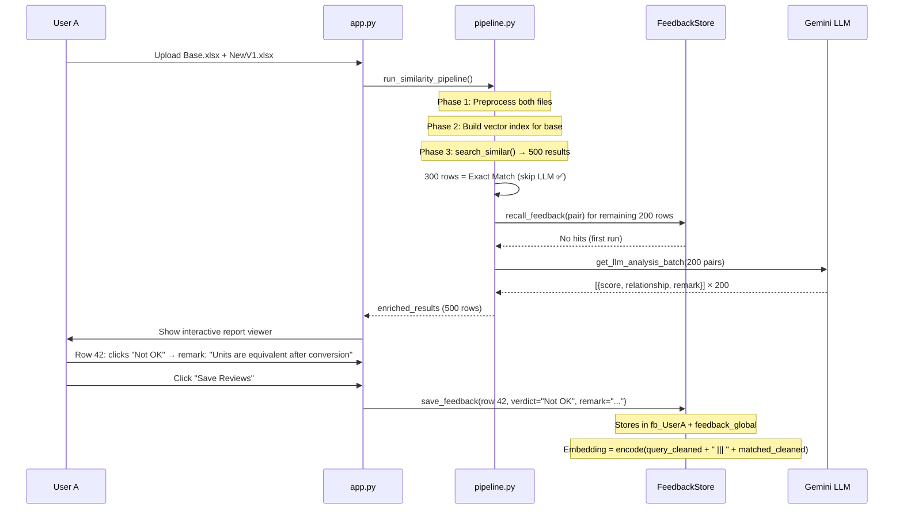
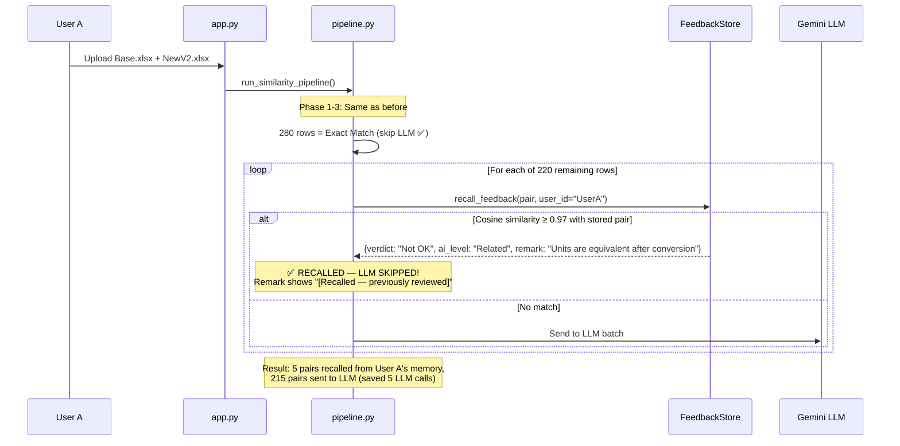
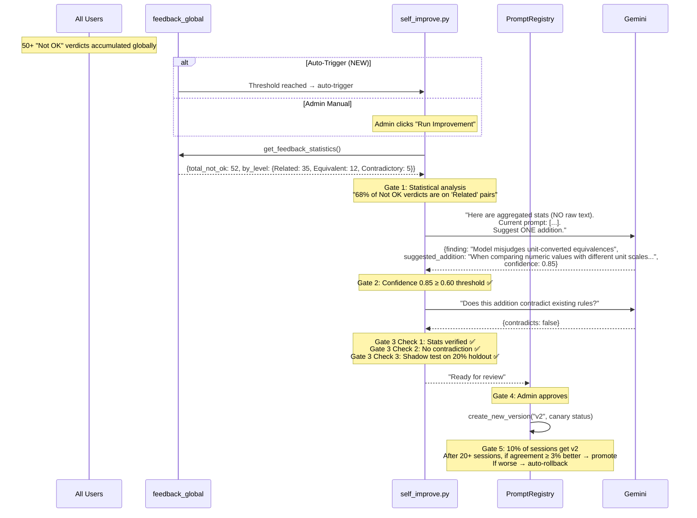
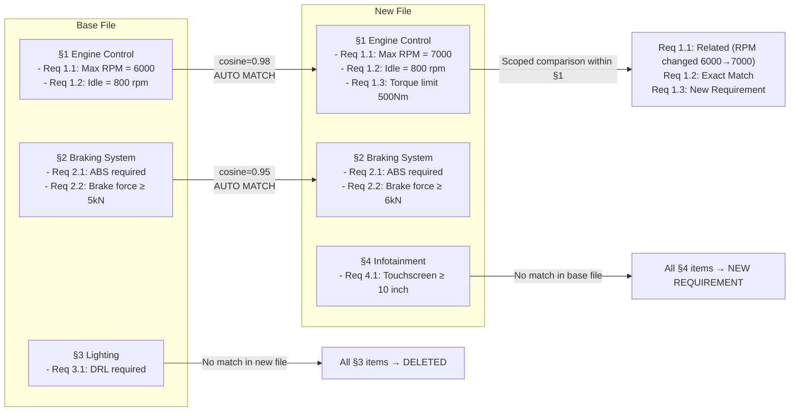

# AIS Assist — Definitive Implementation Plan

> **Scope**: Dual-layer relearning memory, interactive JS report viewer, production bug fixes.
> **Codebase**: 14 Python modules + 5 prompt files + `app.py` (997 lines).

---

## 1. Complete System Architecture

### 1.1 Current Pipeline (6-Skill Flow)

```mermaid
graph TD
    subgraph "Phase 1 — Preprocessing (preprocess.py, utils.py)"
        A["Upload Excel Files<br/>(base spec + new spec)"] --> B["excel_to_json: Read, validate,<br/>clean text, normalize units"]
        B --> C["detect_section_strategy:<br/>LLM or heuristic section detection"]
    end

    subgraph "Phase 2 — Vector Index (core.py)"
        C --> D{"Is Hierarchical?"}
        D -- "Yes (tree ≠ {})" --> E["match_sections:<br/>Embed section titles → greedy cosine<br/>≥0.90 auto-match / 0.70–0.90 Gemini verify"]
        D -- "No (no_structure)" --> F["Flat search_similar:<br/>FAISS IndexFlatIP brute-force"]
    end

    subgraph "Phase 3 — Similarity Search (core.py)"
        E --> G["scoped_search per section pair:<br/>A. Exact string match (score=1.0)<br/>B. Embedding search (FAISS local)<br/>C. Deleted detection (unclaimed base items)"]
        F --> H["Three-phase: exact match → embedding → classify"]
        G --> I["Collect all results"]
        H --> I
    end

    subgraph "Phase 4 — LLM Analysis (pipeline.py, llm_service.py)"
        I --> J["Filter: Exact Match → skip LLM<br/>Below Threshold → skip LLM"]
        J --> K{"Check Short-Term Memory<br/>(recall_feedback, ≥0.97 sim)"}
        K -- "Hit" --> L["Use stored verdict, skip LLM"]
        K -- "Miss" --> M["Batch LLM call<br/>(token-budget-aware batching)"]
        L --> N["Enriched Results"]
        M --> N
    end

    subgraph "Phase 5 — Review & Feedback (app.py, feedback_store.py)"
        N --> O["HTML Table / Report Viewer"]
        O --> P["User Reviews: OK / Not OK"]
        P --> Q["save_feedback → user collection<br/>(fb_{user_id})"]
        P --> R["save_feedback → global collection<br/>(feedback_global)"]
    end

    subgraph "Phase 6 — Self-Improvement (self_improve.py, prompt_registry.py)"
        R --> S["Admin triggers Gate 1-3 pipeline"]
        S --> T["Gate 1: Statistical analysis<br/>(counts, no raw text)"]
        T --> U["Gate 2: LLM pattern analysis<br/>(suggest 1 prompt addition)"]
        U --> V["Gate 3: Validation<br/>(stat check, contradiction, shadow test)"]
        V --> W["Gate 4: Admin reviews & approves"]
        W --> X["Gate 5: Canary deployment<br/>(10% of sessions, auto-promote/rollback)"]
    end
```



### 1.2 Token-Saving Architecture (Exact Match = No LLM Cost)

The system has a **three-layer token optimization** strategy that already exists:

| Layer | Where | How it saves tokens | Status |
|-------|-------|---------------------|--------|
| **Exact String Match** | [core.py L650-669](file:///c:/Users/vicky/Documents/vicky%20project/Exchange-main/Exchange/am_ais_assist/core.py#L650-L669) | If `Cleaned_Text` is identical → score=1.0, label="Exact Match", **zero embedding + zero LLM cost** | ✅ Working |
| **Score Thresholds** | [pipeline.py L238-249](file:///c:/Users/vicky/Documents/vicky%20project/Exchange-main/Exchange/am_ais_assist/pipeline.py#L238-L249) | `≥ LLM_PERFECT_MATCH_THRESHOLD` → "Exact Match" (no LLM). `< LLM_ANALYSIS_MIN_THRESHOLD` → "Below Threshold" (no LLM) | ✅ Working |
| **Short-Term Memory Recall** | [pipeline.py L204-234](file:///c:/Users/vicky/Documents/vicky%20project/Exchange-main/Exchange/am_ais_assist/pipeline.py#L204-L234) | If a semantically identical pair (≥0.97 cosine) was reviewed before → use stored verdict, **skip LLM** | ✅ Working |
| **LLM Result Cache** | [llm_service.py L383-406](file:///c:/Users/vicky/Documents/vicky%20project/Exchange-main/Exchange/am_ais_assist/llm_service.py#L383-L406) | `GlobalCacheManager` + per-user disk cache with SHA-256 keys. Cache hit → no API call | ✅ Working |

> [!TIP]
> **Exact matches are the biggest token saver.** For a 500-row file where 300 rows are identical, only 200 rows go through embedding + LLM. This saves ~60% of API costs.

---

## 2. Current State vs Expected State

### 2.1 Short-Term Memory (User-Scoped)

| Aspect | Current State | Expected State | Gap |
|--------|--------------|----------------|-----|
| **Storage** | ChromaDB `fb_{user_id}` collections ([feedback_store.py L236-238](file:///c:/Users/vicky/Documents/vicky%20project/Exchange-main/Exchange/am_ais_assist/feedback_store.py#L236-L238)) | Same | ✅ None |
| **Recall** | `recall_feedback()` checks cosine similarity ≥0.97 ([feedback_store.py L317](file:///c:/Users/vicky/Documents/vicky%20project/Exchange-main/Exchange/am_ais_assist/feedback_store.py#L317)) | Same | ✅ None |
| **Filter** | **All reviewed rows stored** including Exact Match | **Only non-exact matches** (Equivalent, Related, Contradictory, New, Deleted) — exact matches waste storage | ❌ **BUG: No filter** |
| **Remark capture** | No remark collected from user in current review UI | When user clicks "Not OK", popup modal collects a short remark | ❌ **Not implemented** |
| **Skill file generation** | Not implemented | After review, collect all user corrections → generate per-user skill YAML/JSON file → inject as context in next run | ❌ **Not implemented** |
| **Batch encoding** | Individual encoding per row in recall loop | Pre-encode all pairs in one batch call before the recall loop | ❌ **Optimization needed** |

### 2.2 Long-Term Memory (Global)

| Aspect | Current State | Expected State | Gap |
|--------|--------------|----------------|-----|
| **Storage** | `feedback_global` collection ([feedback_store.py L242-247](file:///c:/Users/vicky/Documents/vicky%20project/Exchange-main/Exchange/am_ais_assist/feedback_store.py#L242-L247)) | Same | ✅ None |
| **Analysis trigger** | Admin-only, manual button click in app.py admin panel | **Dual trigger**: admin manual + **automatic** when `Not OK ≥ FEEDBACK_MIN_NOT_OK` (default 50) | ❌ **Auto-trigger missing** |
| **5-Gate pipeline** | Gates 1-3 in [self_improve.py](file:///c:/Users/vicky/Documents/vicky%20project/Exchange-main/Exchange/am_ais_assist/self_improve.py), Gate 4 = admin UI, Gate 5 = canary | Same | ✅ Working |
| **Canary routing** | MD5 hash routing in [prompt_registry.py L221](file:///c:/Users/vicky/Documents/vicky%20project/Exchange-main/Exchange/am_ais_assist/prompt_registry.py#L221) | Same | ✅ Working |
| **Data retention** | **None** — unbounded growth | Add TTL-based cleanup (configurable, default 90 days) | ❌ **Retention missing** |

### 2.3 Interactive Report Viewer

| Aspect | Current State | Expected State | Gap |
|--------|--------------|----------------|-----|
| **Rendering** | Static HTML table via `df_to_html_table()` in [postprocess.py L118-239](file:///c:/Users/vicky/Documents/vicky%20project/Exchange-main/Exchange/am_ais_assist/postprocess.py#L118-L239) | Interactive JS component with filtering, sorting, review actions | ❌ **Not implemented** |
| **Diff highlighting** | HTML: colors in `highlight_word_differences()` are injected as `<span>` tags ([postprocess.py L260-292](file:///c:/Users/vicky/Documents/vicky%20project/Exchange-main/Exchange/am_ais_assist/postprocess.py#L260-L292)) | Same diff logic, but rendered inside JS component | ⚠️ **HTML highlight works, but hard to verify in Streamlit's `st.markdown(unsafe_allow_html=True)` rendering** |
| **Filtering** | Only in Streamlit sidebar via `st.selectbox` in app.py | Client-side column filters (Level, Score range, Review status) directly in the table header | ❌ **Not implemented** |
| **Review UI** | `st.data_editor` with selectbox per row ([app.py L319-331](file:///c:/Users/vicky/Documents/vicky%20project/Exchange-main/Exchange/app.py#L319-L331)) | Inline ✅/❌ buttons per row + modal remark popup on "Not OK" | ❌ **Not implemented** |
| **"Approve All Exact"** | Not implemented | One-click button to mark all Exact Match rows as "OK" | ❌ **Not implemented** |

---

## 3. How the Relearning Actually Works — Complete Walkthrough

### 3.1 Scenario: User A — First Run



### 3.2 Scenario: User A — Second Run (Agent is Tuned)



> [!IMPORTANT]
> **Key insight**: The agent is "tuned" per-user because `recall_feedback` searches `fb_{UserA}` specifically. User B's corrections don't affect User A's recall. The tuning is automatic — no admin action needed.

### 3.3 Scenario: Global Long-Term Self-Improvement



### 3.4 How Section Comparison Works



---

## 4. Production Bugs Found

### Critical Bugs

| # | Bug | Location | Impact | Fix |
|---|-----|----------|--------|-----|
| **BUG-A** | **Error results get cached** | [llm_service.py L399-402](file:///c:/Users/vicky/Documents/vicky%20project/Exchange-main/Exchange/am_ais_assist/llm_service.py#L399-L402) | `all_clean` checks for `"Error"`, `"Parse Error"`, `"LLM API Call Failed"` but `_call_llm_api` generates `"JSONDecodeError Error"` and `"ValueError Error"` (line 329). These **pass** the check → **poison the cache permanently** | Fix the check to use `endswith("Error")` or match all error variants |
| **BUG-B** | **`response.content` can be None** | [llm_service.py L287](file:///c:/Users/vicky/Documents/vicky%20project/Exchange-main/Exchange/am_ais_assist/llm_service.py#L287) | If API returns None content, `estimate_tokens(content)` at L288 throws `TypeError`. `call_agent_decision` (L572) handles this with `or ""`, but `_call_llm_api` does not | Add `content = response.choices[0].message.content or ""` |
| **BUG-C** | **No filter on feedback storage** | [app.py L353-387](file:///c:/Users/vicky/Documents/vicky%20project/Exchange-main/Exchange/app.py#L353-L387) | All reviewed rows including Exact Match are stored. Exact Match pairs waste storage and can cause false recall hits | Add `if ai_level not in ("Exact Match", "Below Threshold"):` guard before `save_feedback()` |
| **BUG-D** | **Ghost records in ChromaDB** | [feedback_store.py L199-201](file:///c:/Users/vicky/Documents/vicky%20project/Exchange-main/Exchange/am_ais_assist/feedback_store.py#L199-L201) | If `_encode_pair` fails, record stored without embedding. `recall_feedback()` can never find it via cosine search — invisible "ghost" | Add a `has_embedding: "true"/"false"` metadata flag; filter in recall |
| **BUG-E** | **`save_llm_cache` has no file lock** | [llm_service.py L152-166](file:///c:/Users/vicky/Documents/vicky%20project/Exchange-main/Exchange/am_ais_assist/llm_service.py#L152-L166) | Concurrent writes can corrupt cache JSON | Marked deprecated but still importable. Add deprecation warning or redirect to `_append_to_user_cache` |

### Minor Bugs

| # | Bug | Location | Fix |
|---|-----|----------|-----|
| **BUG-F** | `ai_score` stored as string, parsed as float | [feedback_store.py L214](file:///c:/Users/vicky/Documents/vicky%20project/Exchange-main/Exchange/am_ais_assist/feedback_store.py#L214) vs [L443](file:///c:/Users/vicky/Documents/vicky%20project/Exchange-main/Exchange/am_ais_assist/feedback_store.py#L443) | `"N/A"` scores silently excluded from bucketing. Document this behavior or handle explicitly |
| **BUG-G** | `base_file_hash` truncated to 32 chars | [feedback_store.py L218](file:///c:/Users/vicky/Documents/vicky%20project/Exchange-main/Exchange/am_ais_assist/feedback_store.py#L218) | Inconsistent with full hash used elsewhere. Use full 64-char hash |
| **BUG-H** | `utils.py.bak` and dual `util.py`/`utils.py` | Package root | Remove `utils.py.bak`, audit `util.py` (669B) for dead code |
| **BUG-I** | `_SECTION_STRATEGY_FALLBACK` mutable default | [llm_service.py L606](file:///c:/Users/vicky/Documents/vicky%20project/Exchange-main/Exchange/am_ais_assist/llm_service.py#L606) | `heading_values: []` shared between shallow copies. Use `copy.deepcopy()` in fallback return |
| **BUG-J** | No data retention / unbounded ChromaDB growth | [feedback_store.py](file:///c:/Users/vicky/Documents/vicky%20project/Exchange-main/Exchange/am_ais_assist/feedback_store.py) | Add `cleanup_old_feedback(retention_days=90)` method |

---

## 5. Proposed Changes

### Component 1: Interactive JS Report Viewer

#### [MODIFY] [postprocess.py](file:///c:/Users/vicky/Documents/vicky%20project/Exchange-main/Exchange/am_ais_assist/postprocess.py)

Add new function `render_interactive_report(df, base_data, user_data) → str` that generates a self-contained HTML+CSS+JS component:

**Features:**
- Sticky header with column-level dropdown filters (Level, Score range, Review Status)
- Client-side text search across all columns
- Word-level diff highlighting preserved from existing `highlight_word_differences()`
- Per-row action buttons: ✅ OK, ❌ Not OK
- On "Not OK" click: popup modal with text input for remark (max 200 chars)
- "Approve All Exact Matches" button at the top
- Dark theme matching existing `#1e1e2f` / `#2a2a3c` palette
- Bidirectional messaging: JS → Streamlit via `Streamlit.setComponentValue()` for review data

**Technical approach:**
- Use `streamlit.components.v1.html()` for the JS component
- Component posts review data as JSON to Streamlit via `window.parent.postMessage()`
- Python side listens via `st.session_state` updates

#### [MODIFY] [app.py](file:///c:/Users/vicky/Documents/vicky%20project/Exchange-main/Exchange/app.py)

- Replace `st.markdown(html_table, unsafe_allow_html=True)` with `render_interactive_report()` call
- Add handler for JS component review data → update `st.session_state.review_statuses`
- Add "Approve All Exact Matches" server-side handler
- Collect remark text from Not OK reviews → pass to `save_feedback()`

---

### Component 2: Feedback Filter (Exclude Exact Matches)

#### [MODIFY] [app.py](file:///c:/Users/vicky/Documents/vicky%20project/Exchange-main/Exchange/app.py)

In the `Save Reviews` handler (lines 353-387), add a guard:

```python
# Skip storing feedback for Exact Match and Below Threshold rows
if ai_level in ("Exact Match", "Below Threshold"):
    continue  # No value in storing these
```

#### [MODIFY] [feedback_store.py](file:///c:/Users/vicky/Documents/vicky%20project/Exchange-main/Exchange/am_ais_assist/feedback_store.py)

Add `user_remark` field to `save_feedback()` signature and metadata schema:
```python
"user_remark": user_remark[:200],  # NEW: collected from Not OK modal
```

---

### Component 3: Per-User Skill File Generation

#### [NEW] [skill_generator.py](file:///c:/Users/vicky/Documents/vicky%20project/Exchange-main/Exchange/am_ais_assist/skill_generator.py)

New module that generates per-user "skill files" (JSON) from accumulated feedback:

```python
def generate_user_skill(user_id: str, feedback_store: FeedbackStore) -> dict:
    """
    Collect all corrections from fb_{user_id}, cluster by pattern,
    and generate a skill JSON that can be injected into the system prompt.
    
    Returns:
        {
            "user_id": "UserA",
            "generated_at": "2026-06-21T...",
            "correction_patterns": [
                {
                    "pattern": "Unit-converted equivalences",
                    "count": 5,
                    "example_pairs": [...],
                    "instruction": "When comparing numeric values with different unit prefixes..."
                }
            ]
        }
    """
```

**Integration**: In `run_llm_analysis_phase()`, if a user skill file exists, append its instructions to the system prompt for that user's session (per-call override, thread-safe via existing `system_prompt` parameter).

#### [MODIFY] [pipeline.py](file:///c:/Users/vicky/Documents/vicky%20project/Exchange-main/Exchange/am_ais_assist/pipeline.py)

In `run_llm_analysis_phase()`, load user skill file and merge with active prompt:

```python
if user_id:
    user_skill = skill_generator.load_user_skill(user_id)
    if user_skill:
        active_prompt_text = active_prompt_text + "\n\n" + user_skill["instructions"]
```

---

### Component 4: Automatic Self-Improvement Trigger

#### [MODIFY] [feedback_store.py](file:///c:/Users/vicky/Documents/vicky%20project/Exchange-main/Exchange/am_ais_assist/feedback_store.py)

Add method `check_auto_improvement_trigger() -> bool` that checks if `Not OK ≥ FEEDBACK_MIN_NOT_OK` and no improvement pipeline has run since the last batch of feedback.

#### [MODIFY] [app.py](file:///c:/Users/vicky/Documents/vicky%20project/Exchange-main/Exchange/app.py)

After saving reviews, check the auto-trigger:

```python
if feedback_store.check_auto_improvement_trigger():
    # Run improvement pipeline in background thread
    threading.Thread(target=run_improvement_pipeline, args=(...), daemon=True).start()
    st.info("🔄 Auto-improvement pipeline triggered based on feedback volume.")
```

---

### Component 5: Data Retention & Cleanup

#### [MODIFY] [feedback_store.py](file:///c:/Users/vicky/Documents/vicky%20project/Exchange-main/Exchange/am_ais_assist/feedback_store.py)

Add `cleanup_old_feedback(retention_days: int = 90)` method:

```python
def cleanup_old_feedback(self, retention_days: int = FEEDBACK_RETENTION_DAYS) -> int:
    """Delete feedback records older than retention_days. Returns count deleted."""
    cutoff = (datetime.now(tz=timezone.utc) - timedelta(days=retention_days)).isoformat()
    # ChromaDB where filter on timestamp field
```

---

### Component 6: Critical Bug Fixes

#### [MODIFY] [llm_service.py](file:///c:/Users/vicky/Documents/vicky%20project/Exchange-main/Exchange/am_ais_assist/llm_service.py)

**BUG-A fix** (line 399-402):
```python
# BEFORE (broken):
all_clean = all(
    res.get("Similarity_Level") not in ("Error", "Parse Error", "LLM API Call Failed")
    for res in response["results"]
)

# AFTER (fixed):
all_clean = all(
    not str(res.get("Similarity_Level", "")).endswith("Error")
    and res.get("Similarity_Level") not in ("LLM API Call Failed",)
    for res in response["results"]
)
```

**BUG-B fix** (line 287):
```python
# BEFORE:
content = response.choices[0].message.content

# AFTER:
content = response.choices[0].message.content or ""
```

**BUG-I fix** (line 701):
```python
# BEFORE:
return dict(_SECTION_STRATEGY_FALLBACK)

# AFTER:
import copy
return copy.deepcopy(_SECTION_STRATEGY_FALLBACK)
```

#### [MODIFY] [feedback_store.py](file:///c:/Users/vicky/Documents/vicky%20project/Exchange-main/Exchange/am_ais_assist/feedback_store.py)

**BUG-D fix**: Add `has_embedding` metadata flag.
**BUG-G fix**: Use full 64-char hash.
**BUG-J fix**: Add `cleanup_old_feedback()` method.

#### [DELETE] [utils.py.bak](file:///c:/Users/vicky/Documents/vicky%20project/Exchange-main/Exchange/am_ais_assist/utils.py.bak)

Dead backup file. Remove.

---

## 6. Implementation Order

| Phase | Priority | Component | Estimated Effort |
|-------|----------|-----------|-----------------|
| **1** | 🔴 Critical | Bug fixes (BUG-A through BUG-E) | 2-3 hours |
| **2** | 🔴 Critical | Feedback filter (exclude Exact Match) + remark field | 1 hour |
| **3** | 🟡 High | Interactive JS Report Viewer | 6-8 hours |
| **4** | 🟡 High | Per-user skill file generation | 3-4 hours |
| **5** | 🟢 Medium | Automatic self-improvement trigger | 2 hours |
| **6** | 🟢 Medium | Data retention cleanup | 1 hour |
| **7** | 🔵 Low | Batch encoding optimization | 2 hours |

---

## 7. Verification Plan

### Automated Tests
```bash
pytest tests/ -v
```

### Manual Verification
1. **Bug fixes**: Run pipeline with a file that triggers LLM parse errors → verify errors are NOT cached
2. **Feedback filter**: Review results, mark Exact Match as "OK" → verify it's NOT stored in ChromaDB
3. **JS Viewer**: Load results → verify column filters, diff highlighting, OK/Not OK buttons, remark modal
4. **Relearning**: Run twice with same user → verify second run recalls previous corrections
5. **Skill generation**: After 5+ corrections by User A, verify skill file is generated and injected
6. **Auto-trigger**: Accumulate 50+ Not OK verdicts → verify self-improvement pipeline auto-runs
7. **Data retention**: Set retention to 1 day → verify old records are cleaned up

---

## 8. Open Questions

> [!IMPORTANT]
> **Q1**: Should the "Approve All Exact Matches" button auto-save to ChromaDB, or just update the UI state? (Recommendation: UI state only, since we're filtering out Exact Match from storage anyway.)

> [!IMPORTANT]
> **Q2**: For the per-user skill file, should we cap the number of correction patterns (e.g., top 10 most frequent)? Large skill files would increase prompt tokens.

> [!WARNING]
> **Q3**: The auto-trigger for self-improvement runs in a background thread. Should we add a cooldown period (e.g., max once per 24 hours) to prevent rapid re-triggers?

> [!NOTE]
> **Q4**: The existing `util.py` (669 bytes) — is this a dead file or actively used? If dead, we should remove it alongside `utils.py.bak`.
